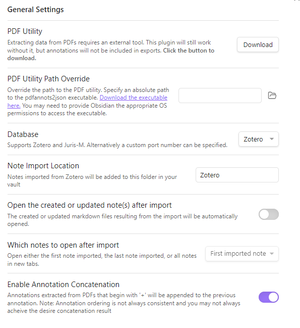
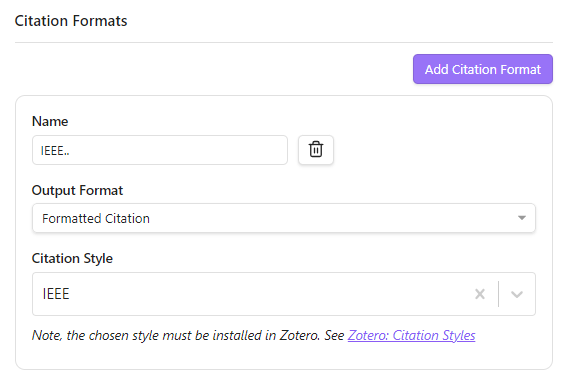
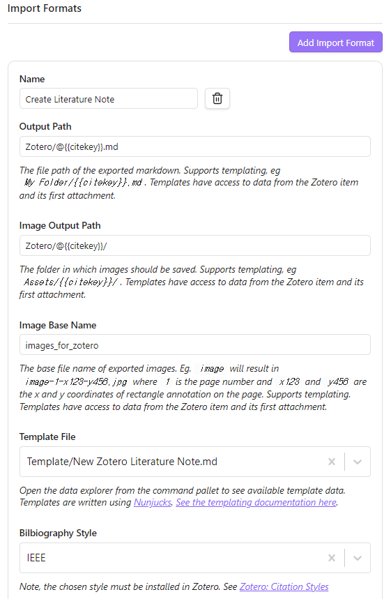

<div class="notice--info" markdown="1" style='font-size: 20px'>
**motivation:**  zotero를 활용하여 second brain을 만들어보자. 
</div>


## 1. zotero, extension 설치

우선 zotero를 깔고, 1. Bibtex, 2. MarkDB-connect, 3. Zotfile 4. scite Plugin for Zotero plugin을 설치하고, 적용한다. (윈도우에서는 도구--> add-ons에서.)(맥에서는 tool--> plugin --> install from file)

설치하는 방법은 각각을 구글에 검색해서, 설치 방법대로 설치하면 된다. 

extension을 추가하는 방법은, 도구 --> 확장자 --> 톱니바퀴 --> `install add on from file` --> 다운받은 .xpi 파일 선택 하면, 설치가 된다. 재시작하면 볼 수 있다.

또 **zotero에서** 편집 --> 환경설정 -->Better BibTeX --> Open Better BibTeX preferences --> citation key formula를 `shorttitle(3,3)+authors(n=1,etal=EtAl)+year` (ref: [https://retorque.re/zotero-better-bibtex/citing/](https://retorque.re/zotero-better-bibtex/citing/))이렇게 바꾸어주고 저장한다. 


## 2. tag 설정

새로운 독립 노트 (위 탭에서 노트처럼 생긴 icon) 만들고, zotero tag taxonomy 라는 파일을 만들고, 오른쪽 밑에 tag를 눌러서, tag를 추가한다.

tag를 추가하면 왼쪽 아래에 만들어진 tag들이 보이는데, tag들을 오른쪽 클릭 --> 색상 설정을 통해서 색상과 번호를 지정해줄 수 있다.

그러면 어떤 논문을 클릭하고, 1번을 누르면 해당 tag가 기록되게 된다.


## 3. obsidian에서 zotero integration 이라는 plugin 설치

설정은 다음과 같이 진행한다.





물론 Template 폴더 안에는 `New Zotero Literature Note` 라는 이름을 가진 파일이 있어야 하고, 내용은 아래와 같아야 한다.

``` md


# self notes

### Research

* Methodology::
* Key Contructs::
	* IVs::
	* DVs::
	* Moderators::
	* Others::
* Key_Findings::
* Contributions::
* Limitations::

### Self Critique

* Critique
	* Strengths
	* Limitations

* How is it relevant to my research?
	* Relevant_topic::
	* Use::


> [!Cite]
> {{bibliography | replace('\n', ' ')}}

> [!Synth]
> **Contribution::**

> [!Md]
>  
> **{{creator.creatorType | capitalize}}**:: {{creator.lastName}}, {{creator.firstName}}
> 
> {{creator.creatorType | capitalize}}:: {{creator.name}}
> **Title**:: {{title}}
> **Year**:: {{date | format("YYYY")}}
> **Citekey**:: [[@{{citekey}}]]
> 
> > **Tags**:: {{allTags}} 
> > **itemType**:: {{itemType}}
> > **journal**:: {{publicationTitle}} 
> > **Volume**:: {{volume}} 
> > **Issue**:: {{issue}} 
> > **Book**:: {{publicationTitle}} 
> > **Publisher**:: {{publisher}} 
> > **Location**:: {{place}} 
> > **Pages**:: {{pages}} 
> > **DOI**:: {{DOI}} 
> > **ISBN**:: {{ISBN}} 

> [!Link]
>  [{{attachment.title}}]({{attachment.path | replace(" ", "%20")}}) 

> [!Abstract]
> 
> abstract:: {{abstractNote}} 
> 

---

# Annotations


### {{annotation.annotatedText | escape }}
> [!Highlight]
> {{annotation.annotatedText | escape }} ({{annotation.page}} )
>   

> [!Image]
> }})
> 


> [!Highlight]
**Comment**:
> {{annotation.comment}} 



---


```


## 4. obsidian에서 논문 정리본 받아오기

그러면 zotero에서 논문을 마음껏 figure도 선택하고, 줄도 highlight+comment달기 를 했으면,

ctrl + P 한 다음, `zotero integration: create literature note`를 선택하면, 
obsidian의 /Zotero/ 폴더에 문서에 들어갈 사진들과 문서가 나타나게 된다.

그리고 자유롭게 수정하고, 하면 된다.

## 5. dataview (obsidian community plugin)

dataview의 문법은 다음과 같다. \`\`\` 옆에 dataview라고만 적어주면 query가 자동으로 등록이 된다. 1. TABLE은 뭐를 찾을지가 나오고, 2. FROM은 tag나 폴더를 적어주면 된다. OR/AND로 하면 되고, -는 그 폴더를 제외하라는 뜻이다. 3. WHERE는 잘 모르겠다.

```
TABLE
	created As "Created",
	property1 as "good property", 
	author,
	topic
FROM  
	#flow or -"_posts"
WHERE
	tag = "네이버 블로그"
```


## 5. research rabbit

zotero와 연동이 되는 research rabbit은, collection에 관련 논문들을 모아두면, 인용이 겹치는 것을 찾아준다. graph view로. 

[https://researchrabbitapp.com/home](https://researchrabbitapp.com/home)
에서 zotero랑 연동만 하면 쓸 수 있다.