

**motivation:**  Create Your World: Lifelong Text-to-Image Diffusion  TPAMI 2024, Gan Sun et al., 논문을 이해해보자.

# self notes

### Research

* Methodology::
* Key Contructs::
	* IVs::
	* DVs::
	* Moderators::
	* Others::
* Key_Findings::
* Contributions::
* Limitations::

### Self Critique

* Critique
	* Strengths
	* Limitations

* How is it relevant to my research?
	* Relevant_topic::
	* Use::

> [!Cite]
> [1]  G. Sun, W. Liang, J. Dong, J. Li, Z. Ding와/과Y. Cong, “Create Your World: Lifelong Text-to-Image Diffusion”, 2023년 9월 8일, _arXiv_: arXiv:2309.04430. 접근된: 2024년 7월 25일. [Online]. Available at: [http://arxiv.org/abs/2309.04430](http://arxiv.org/abs/2309.04430)

> [!Synth]
> **Contribution::**

> [!Md]
>
> **Author**:: Sun, Gan> 
>
> **Author**:: Liang, Wenqi> 
>
> **Author**:: Dong, Jiahua> 
>
> **Author**:: Li, Jun> 
>
> **Author**:: Ding, Zhengming> 
>
> **Author**:: Cong, Yang> 
>
> **Title**:: Create Your World: Lifelong Text-to-Image Diffusion
> **Year**:: 2023
> **Citekey**:: [[@2023-01-01-CreateYourWorldSunEtAl2023]]
> 
> >**Tags**:: Computer Science - Artificial Intelligence, Computer Science - Computer Vision and Pattern Recognition
> >**itemType**:: preprint
> >
> >
> >
> >
> >
> >
> >
> >
> >

> [!Link]
> [Sun 등 - 2023 - Create Your World Lifelong Text-to-Image Diffusio.pdf](C:\Users\wys00\Zotero\storage\WU6N7PKX\Sun%20등%20-%202023%20-%20Create%20Your%20World%20Lifelong%20Text-to-Image%20Diffusio.pdf)

> [!Abstract]
>
> abstract:: Text-to-image generative models can produce diverse high-quality images of concepts with a text prompt, which have demonstrated excellent ability in image generation, image translation, etc. We in this work study the problem of synthesizing instantiations of a user’s own concepts in a never-ending manner, i.e., create your world, where the new concepts from user are quickly learned with a few examples. To achieve this goal, we propose a Lifelong text-to-image Diffusion Model (L2DM), which intends to overcome knowledge “catastrophic forgetting” for the past encountered concepts, and semantic “catastrophic neglecting” for one or more concepts in the text prompt. In respect of knowledge “catastrophic forgetting”, our L2DM framework devises a task-aware memory enhancement module and a elastic-concept distillation module, which could respectively safeguard the knowledge of both prior concepts and each past personalized concept. When generating images with a user text prompt, the solution to semantic “catastrophic neglecting” is that a concept attention artist module can alleviate the semantic neglecting from concept aspect, and an orthogonal attention module can reduce the semantic binding from attribute aspect. To the end, our model can generate more faithful image across a range of continual text prompts in terms of both qualitative and quantitative metrics, when comparing with the related state-of-the-art models. The code will be released at https://wenqiliang.github.io/. Random samples Index Terms—Lifelong Machine Learning, Stable Diffusion, Image Generation, Continual Learning. 
>

---

# Annotations 

### 1 INTRODUCTION 

기존의 제안된 T2I diffusion model은 preset large-scale dataset and fixed concepts에 대해서 생성 능력을 늘리는 것에 초점을 두었다. 이런 모델들은 user가 안본 개념에 대해서 일반화할 수 없다.

이런 모델들에 대해서, 유저의 'loved dog' 에 대해서, 사진을 생성시키고 시다면, diffusion model을 다시 학습시키면 될 것이다. 근데 문제는, 다음날에 James라는 친구 이름을 추가하고 싶다면, James를 dataset에 추가해서 fine-tuning을 large-scale diffusion model에 하면, computational cost랑 fine-tune process를 비실용적으로 만든다. 왜냐하면 user는 pre-trained large-scale diffusion model에서 새로운 개념들을 계속 배워야 하기 때문이다.

그래서 우리는 Lifelong T2I diffusion model을 제안한다. 이 모델은 연속적으로, user의 multiple personalized concept을 학습하면서, 기존의 distinctive 한 feature들은 보존하도록 하는 방법이다.

lifelong T2I diffusion 세팅의 문제들은 다음과 같다.

1. **catastrophic forgetting**
	1. **prior knowledge forgetting:**
		- personalized한 개념을 배우고 나면, original한 data에 대해서 diffusion model의 일반화 능력이 일관되지 않을 수 있다. 이게 무슨 말이냐면, 내가 새로 배우는 moongate라는 개념과 기존의 diffusion이 알고 있었던 moon과 개념이 다를 때, moon의 개념이 일관(?)되지 않을 수 있다. (moon의 개념이 moongate에 의해서 달라지는 것.) 그래서 moon이라는 개념을 forget해야 하는 문제인 것이다.
	2. personalized knowledge forgetting:
		- user에 의해서 주어진 concept들을 되돌릴 수 있는 능력을 의미한다. personalized concept을 배워도, 이전에 original한 개념을 additional training data 없이 다시 복원할 수 있어야 한다.

2.  **catastrophic neglecting**
		하나의 prompt를 가지고, target prompt의 semantic catastrophic neglect를 피하면서, 여러개의 personlized 개념들을 정확히 생성하는 방법을 의미한다. --> e.g. "a photo of pet dog with James" 의 경우, James가 안나올 수 있음. catastrphic neglect.
			e.g., concept neglecting의 영향을 극복하는 것은 stable diffusion의 주요 과제 중 하나다.
		**attribute neglecting / catastrophic homogenization:** 두개의 물체가 비슷한 시각적 특징을 가지고 있으면, stable diffusion은 attribute neglecting을 하게 될 수 있다. --> e.g. "photo of a dog and cat": two dogs, two cats가 나올 수 있음. (이거는 무시는 아니고, 특성을 무시하는 것이어서, attribute neglecting인듯.)

결국 우리는 continual personalized T2I lifelong diffusion framework을 제안한다. 우리 모델은 새로운 개념의 sequence를 추가하는 과정이 memory efficient, computation effective하다.

그러나 위의 challenge들을 tackle하기 전에, 기저에 있는 가정(가설)이 있다.

> [!Highlight]
> the underlying hypothesis is that the pre-trained diffusion model can be updated with a few samples of the new concept, which motivates we design a Lifelong text-to-image Diffusion Model (L2DM) via considering **lifelong-task learning and multi-concept generation.** (2 )
>  

더 구체적으로 얘기하자면, 우리는 다음과 같은 것들을 개발하였다.

1. **task-aware memory enhancement module** (prior knowledge 보존을 위해서)
2. **elastic concept distillation module** (personalized knowledge 보존을 위해서)
이 모듈들은 lifelong generation task sequeunce에 대해서, 

이 두가지 모듈들은 'prior concept과 learned personalized concept'를 배우면서, 그 concept들의 각각의 특징(identifying features)들이 잘 보호될 수 있게 만들어준다.

또한 

3. **concept attnetion artist module** (concept-neglecting을 완화하기 위해서)과
4. **orthogonal attention module** (attribute-neglecting을 완화하기 위해서)

의 새로운 module들을 제안한다. 이 두개의 module들은 모둔 multiple concept들이 image에 들어가도록 하는 module들이다.

user가 주는 새로운 concept이나 genration task를 주어졌을 때, 우리의 lifelong learning mechanism은 **rainbow-memory bank strategy**를 통해서 **elastic하게 concept knowledge를 배울 수 있다.**
그런 다음, attention artist module을 통해서 생성된 이미지에 대한 semaintic information을 변경시킨다.

또한 extensive experiments를 통해서 SOTA와의 비교도 했다.

L$^2$DM 의 novelty는 다음과 같다.
- L$^2$DM senario를 처음 explore한다.
- catastrhopic forgetting을 위해서는, task aware memory enhancement module과 elastic concept distillation module을 사용한다. 이 모듈들은 각각 prior knowledge를 rehearsal 측면에서 공고화 시킬 수 있고, elastic하게 personalized knowledge를 distill 할 수 있다.
- catastrophic neglecting issue에 대해서는, novel concept attention artist module and an orthogonal attention module을 제안한다 (multiple user-specific concepts을 생성할 때 발생되는 문제). 그래서 이를 통해서, text prompt에 있는 described semantics를 다 설명할 수 있게 된다.

### 2 RELATED WORK 

이 부분은 1. Lifelong Machine learning과 2. T2I diffusion에 대해서 간략하게 다른다.

#### 2.1 lifelong Machine Learning

lifelong machine learning은 선택적 정보를 이전 task cluster에서 현재 새로운 task로 transfer 시키려고 하는 것이다. 또는 변하지 않는 지식을 전이시키려고 하는 것이다. LML의 main target은 non-stationary data stream을 파괴적이지 않으면서, 학습할 수 있도록 하는 것이다.

[12] G. Sun, Y. Cong, Y. Zhang, G. Zhao, and Y. Fu, “Continual multiview task learning via deep matrix factorization,” IEEE Transactions on Neural Networks and Learning Systems, pp. 1–12, 2020. 이 논문은 cross-domain lifelong learning framework for reinforcement learning. 을 제안.

[13] J. Kirkpatrick, R. Pascanu, N. Rabinowitz, J. Veness, G. Desjardins, A. A. Rusu, K. Milan, J. Quan, T. Ramalho, A. Grabska-Barwinska et al., “Overcoming catastrophic forgetting in neural networks,” Proceedings of the national academy of sciences, vol. 114, no. 13, pp. 3521–3526, 2017.  이 논문은 EWC model을 개발, FIM의 diagonal을 이용.

[14] Z. Li and D. Hoiem, “Learning without forgetting,” in European Conference on Computer Vision, 2016, pp. 614–629. 이 논문은 LwF 개발, convolutional neural network에 적용. which could retrain the neural networks, which could retrain the neural networks without using the past task data.

[15] J. Yoon, E. Yang, J. Lee, and S. J. Hwang, “Lifelong learning with dynamically expandable networks,” in Sixth International Conference on Learning Representations. ICLR, 2018. 이 논문은 novel deep network을 제안, 동적으로 network capacity를 결정. task의 sequence가 올 때. --> DEN.

[16] S. Yan, J. Xie, and X. He, “Der: Dynamically expandable representation for class incremental learning,” in Proceedings of the IEEE/CVF Conference on Computer Vision and Pattern Recognition, 2021, pp. 3014–3023. 이 논문은 learnable feature extractor를 추가. 이전에 배운 것은 freeze. --> DER.

[17] A. Douillard, A. Ramé, G. Couairon, and M. Cord, “Dytox: Transformers for continual learning with dynamic token expansion,” in Proceedings of the IEEE/CVF Conference on Computer Vision and Pattern Recognition, 2022, pp. 9285–9295. 이 논문은 transformer인데 dynamic expansion of task tokens in CL paradigm. --> DyTox.

가장 최근에 제안된 discussion에서, 근데 T2I에서 어떻게 CL을 할지에 대한 논의는 없음. 그래서 우리 work이 pioneering work임.

#### 2.2 T2I diffusion,

diffusion model은 remarkable generative power in various fields 를 보여주었다. pretrained CLIP을 이용해서, text input을 condition vector로 바꿔서, image generation에 많은 성공적인 application들을 보여줌.

예를 들어서, 
- GLIDE: represents a text-guided diffusion model인데, image generation과 editing 능력을 보여둠.
- Imagen은 image generation을 위해서 classifier free guidance와 pretrained large language model을 적용했다.
- Stable diffusion은 VQ-GAN을 사용해서, pixel space에서 latent space로 representation space를 mapping시켰다. 이를 통해서 computational burden을 줄일 뿐만 아니라, 잘 압축된 semantic feature들과 visual pattern들을 활성화시켰다.
- StructureDiffusion과 Attend-and-excite 논문 두개는 병렬적으로 'synthetic image of pretrained stable diffusion에서 발생하는 catastrophic neglect' 문제의 risk를 정의하고, 이 risk를 완화하는 방법을 소개한다. 이 완화하는 방법은, structured guidance나 refining the cross-attention unit 통해서, 이 risk를 완화한다.

#### 2.3 Personalized T2I diffusion

user 본인의 concept들과 align할 수 있는 이미지를 만들기 위한, stable diffusion의 potential을 활용하기 위해서, **fine-tuning**을 통한 customization과 personalization 에 초점을 두었다. 기존 연구는.

예를 들어서, 
- DreamBooth는 class-specific prior preservation loss를 통해서, prior knowledge를 보호하고, stable diffusion의 모든 paramter를 fine-tuning한다.
- 대조적으로, Textual Inversion은 오직 새로운 concept을 위한 word vector를 학습하는데에 초점을 둔다.
- Custom Diffusion은 특정 attention layer에 대해서만 제한적인 parameter 수만 선택적으로 fine-tune을 한다. 그래서 빠른 tuning을 촉진한다.
- SVDiff는 SVD를 Stable diffusion의 weight matrices 사용해서, personalized dataset에 대해서 효과적인 tuning을 가능하게 한다.

그럼에도 불구하고, 이런 모델들은 **past data를 사용하지 않고** 연속적으로 새로운 T2I duffusion task를 **학습할 수 없다.**

## 3 LIFELONG TEXT-TO-IMAGE DIFFUSION MODEL (L2DM) 

이 section에서는 ifelong T2I diffusion method를 다양한 측면에서 소개할 것이다. 먼저 T2I diffusion model에 대한 background를 3.1 에서 소개하고,

lifelong diffusion framework의 problem definition을 3.2에서 다룰 것이고, 

3.3에서 우리가 제안한 모델을 볼 것이다. 그래서 이 제안된 모델이, 어떻게 continual concept learning을 잘 할 수 있는지, 그리고 multiple concepts를 잘 생성할 수 있는지 볼 것이다.

### 3.1 Revisit Text-to-Image Diffusion Model 

#### stable diffusion
Stable diffusion은 generated image를 단계적으로 정제를 하는 과정을 거친다. multiple iteration을 통해서. 이것을 통해서, text와 image간 semantic gap을 연결한다. latent encoder 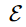와 decoder 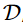를 사용해서, LDMs(stable diffusion)은 representation을 low-dimensional 하고 enriched-semantic latent space에서 추정할 수 있다.
더 구체적으로, T2I generation task는, LDMs의 변이로, text prompt 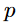와 initial noise map 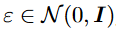를 가지고, 

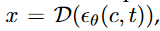 이미지 x를 이렇게 만들게 된다. 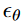  는 diffusion model을 의미하고, 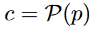 에서 P는 CLIP의 text encoder이다.

(즉 prompt를 CLIP text encoder에 통과하면 conditioned vector c가 나오고, c와 timestep t를 diffusion model에 넣어준 것을 VQ-VAE의 decoder에 통과시키면 이미지가 나온다는 것.)

그래서, formal하게 diffusion model은 어떻게 training이 되냐하면, 
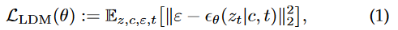
이렇게 noise image를 denoise해서, denoised output을 내도록 학습을 하는 것이다.

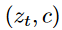 :  corresponding pairs of image latents and text embeddings, 
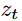: a latent code obtained from encoder E, 
 : the corresponding model parameters. 
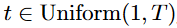 : which will be omitted in the following sections for brevity.

#### Dreambooth

Dreambooth는 T2I model을 personalize하려고 했다. fine-tuning 하는 형식으로.

예를 들어서, pretrained T2I diffusion model은 personalized dataset으로 fine-tuing 될 수 있다. **한 3~5개의 image-text pair dataset으로.**

그래서 PDM (Personalized T2I Diffusion Model)은 equivalaent text prompt를 통해서, target concept의 unprecedented image를 생성할 수 있게 된다. --> **이때 personalized model의 prior knowledge는 안변한 상태로 있게 된다.**

이거를 달성하기 위해서, Dreambooth는 class-spedific prior preservation loss를 제안한다. 이 loss는 새로운 concept에 대해서 overfitting에 저항하기 위해서, 또한 prior knowledge를 보존하기 위해서 쓴다. 

training objective는 다음과 같다.

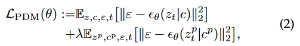

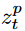 는 stable diffusion에 의해서 만들어진 이미지로부터 encoding 된 latent space를 의미하고, 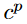 는 이에 대응되는 text condition이고, 람다는 두번째 항의 backpropagation을 control하기 위한 항이다.

(개인적으로 정리: 그니깐 두번째 term은 기존에 학습된 diffusion model을, 예를 들어서 \[V\] (unique identifier) dog (dog는 unique identifier의 상위 개념) 을 학습하고자 한다면, dog과 그에 해당하는 이미지를 왕창 만들어놓고, 즉 'a photo of a dog'의 prompt를 줘서 이미지를 엄청 만들어놓고,그 condition을 계속 학습하는 것. 왜 기존의 지식을 까먹지 않으려고. 그래서 람다가 작을수록, 더 few-shot sample에 overfitting하게 되고, 클수록 학습할 이미지와 멀어지게 됨.)

personalized T2I diffusion senario는 그러나 continually learning new concepts without repeatly using past traninig data는 고려하지 않는다.

### 3.2 Problem Definition for Lifelong Text-to-Image Diffusion 

#### 문제 정의:
generation tasks: 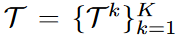

datasets: 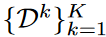
k-th generation task는 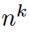 개의 pair로 구성됨. 어떤 pair냐면, concept image 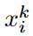 와 prompt 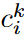 로 구성이 되어 있는 것. 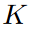 는 task의 개수를 의미, 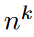는 3에서 5개다. 이 paper에서는.

 

이전의 recent prior-based personalized generation 방법들과 다르게, 우리는 consecutive specific concepts를 lifelong하게 받는 시나리오를 생각하고 있다. 특히 **각각의** concept generation task 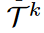 가 아래 식 (2)로 표현될 수 있는 것이다.

각각의 timestep에 대해서,  k번쨰 task가 concept image  와 prompt  의 pair가   개의 pari를 가지고 lifelong T2I diffusion에 uesr에 의해서 학습이 될 때, 이 시스템은 새로운 concept을 배우면서, 새로운 concept과 이미 배운 concept을 효율적으로 잘 융합시켜야 한다. 

privacy leakage와 limited memory를 생각하지 않는다면, **data pair들이 현재 task에만 쓸 수 있다고 가정하면 (== 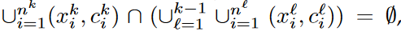)** ***그러면 lifelong T2I diffusion 문제는 다음과 같이 적힐 수 있다.***

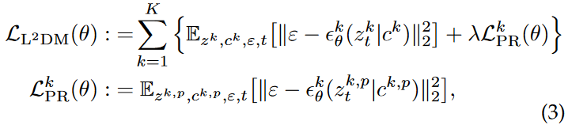

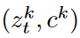: **image latents 와 text embedding의 pair, for k-th generation task**

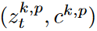: **prior pairs generated by pretrained model for the k-th generation task.**

(Dreambooth에서, prior preservation loss로 사용하는 것. 이거는 결국 λ𝜆는 prior-preservation 항의 상대적 가중치를 조절하는 값이다. 저자들은 loss가 단순함에도 불구하고 overfitting과 language-drift 문제를 극복하는 데 효과적이라는 것을 발견했다. 200 이하의 epoch, learning rate 10−510−5, λ=1𝜆=1으로 두는 것이 좋은 결과를 달성하는 데 충분하다고 한다. 학습 과정에서 200×N×𝑁개 이하의 “a [class noun]” 샘플들이 생성되며, N𝑁은 주제 데이터셋의 크기로 일반적으로 3~5이다. 학습 과정은 1개의 TPUv4에서15분이 걸린다.)[https://kimjy99.github.io/%EB%85%BC%EB%AC%B8%EB%A6%AC%EB%B7%B0/dreambooth/](https://kimjy99.github.io/%EB%85%BC%EB%AC%B8%EB%A6%AC%EB%B7%B0/dreambooth/)

그래서 eq 3을 통해서, diffusion model paramter theta를 얻는 것이 목표인 것이다.
**구체적으로, 목표점은 다음과 같다.** 
- **Generation Performance:** 기존의 일반화 성능에서 concept을 drift 또는 neglect 시키지도 않아서, 정확히 multiple personalized concept을 생성하도록 만드는 것.
- **Computation Efficiency:** 기존의 방법론들보다 더 빨리 새로운 concept을 학습시킬 수 있어야 한다.
- **Lifelong Learning:** 계속 continual하게 user의 data가 들어온다고 하더라도, 새로운 개념들을 잘 학습할 수 있어야 한다.

**즉 eq3의 loss function으로 학습하면서, 3가지 target을 만족하기 위해서, **

**catastrophic forgetting과 neglecting 문제를 해결하는 4가지 module들에 대해서 소개할 것이다.** 

### 3.3 The Proposed L$^2$DM Framework 

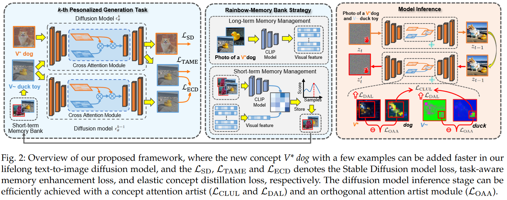

figure 2에 제시된 것처럼, L$^2$DM 를 우리는 제시한다. prior knowledge를 보존하면서, 새로운 personalized generation task를 연속적으로 배우는 것을 목표로 하는 것.

#### catastrophic forgetting

catastrophic forgetting의 문제를 해결하기 위해서, 우리는 task-aware memory enhancement module **(TAME)** 과, elastic concept distillation **(ECD)** 를 고안했다.

**이 두가지 module은 1. previous task의 지식을 보호하고, 2. 새로 encounter한 task에 대해서 효과적으로 representational capacity를 확장 시키는 역할을 같이 동시에 수행하게 된다.**

#### catastrophic neglecting

L$^2$DM의 model의 multi-concept inference stage 과정에서 발생하는, catastrophic neglect and homogenization 문제를 tackle하기 위해서, concept attention artist **(CAA)** 모듈과 orthogonal attention artist **(OAA)** module을 개발했다.

이 두가지 module은 each individual concept의 representation을 보호하고, 그 concept들의 각각의 특징(identifying features)에서 생기는 catastrophic neglecting risk를 완화하여, 다른 concept에 의해서 해롭게 감염되지 않도록 만든다. **(무엇이? individual concept의 representation이)**

#### 3.3.1 Lifelong-task Learning 

large-scale diffusion model에서, 지식이 learned task에서 new task로 이동할 때, 은 catastrophic forgetting을 어떻게 완화하는가?

기존의 lifelong learning problem과 다르게, (LWF, EWC), 우리는 이 work에서  L$^2$DM의 두개의 distinct한 forgetting aspects를 고려해야 한다.

\1. **prior-forgetting**: 새로운 personalized concepts를 model에 통합시킬 때, 기존에 배운 prior concept를 잃어버릴 수 있다.
\2. **personalized-forgetting**: 우리의 L$^2$DM이 연속적으로  user personalized concepts을 배우는데, 더 이전에 배운 personalized concept도 잊혀질 수 있다.

이 lifelong-task learning의 두가지 challenge들을 tackle하기 위해서, 다음 section에서 lifelong learning algorithm을 자세히 설명할 것이다.

\1. task-aware memory enhancement
\2. elsatic concept distillation

#### 3.3.1.1 Task-Aware Memory Enhancement (TAME): 

To tackle **prior-forgetting** when facing with a new user-specific concept, one naive approach is to retain or fine-tune the diffusion model ***via storing dataset of user-specific concepts.***

**--> 어떻게 prior forgetting을 가장 잘 안일으킬 수 있는 sample을 찾는 것.**
--> 그러나 이 문제는 computation, storage cost가 너무 듬.
--> 또 training data 가지고 있는 것이 privacy 측면에서 좀 그럼.

그래서 eq2에서 영감을 받아서, prior-forgetting을 줄이면서(2nd term) **personalized-forgetting 보존하도록, 하게 'task-aware memory enhancement module'를 고안했다.(1st term)**

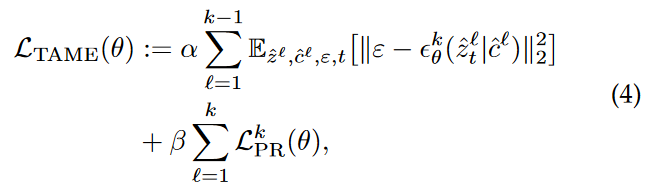

L$^2$DM의 memory enhancement module은 위와 같다.

ˆ : represents the input 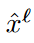is from short-term memory
hyperparameter μ is utilized to reweight the loss function.

자세히 설명하자면, Eq (4)의 첫번쨰 term은 L2DM을 지도하는 term인데, fine-grained memory bank를 사용한다. 이 memory bank는 learned personalized concepts에 대응되는 generated data다.

기존의 3번 식과 다른 점은 첫번쨰 항인데, STM에서 온다는 것이 다르다. memory bank에서 오는데, 그러면 어떻게 STM, LTM를 어떻게 store 하는가? 이거는 **Rainbow-Memory Bank Strategy** 에서 다룬다.

#### 3.3.1.2 Rainbow-Memory Bank Stragegy: 

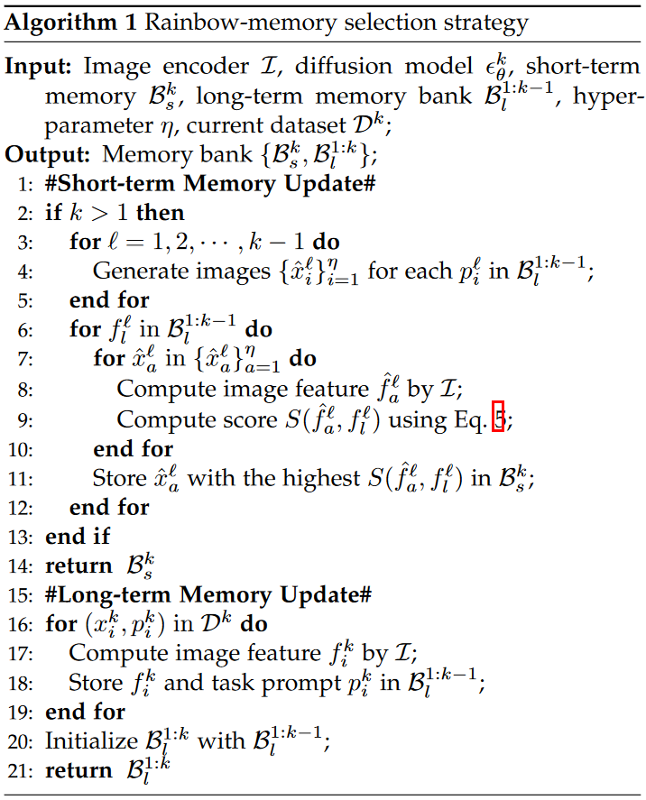

결국 short term memory는 
prior-forgetting을 줄이면서(2nd term) 
**personalized-forgetting (1st term)이 first term이 바뀐 것.** 이거를 줄이겠다는 것.

STM는 어떻게? 

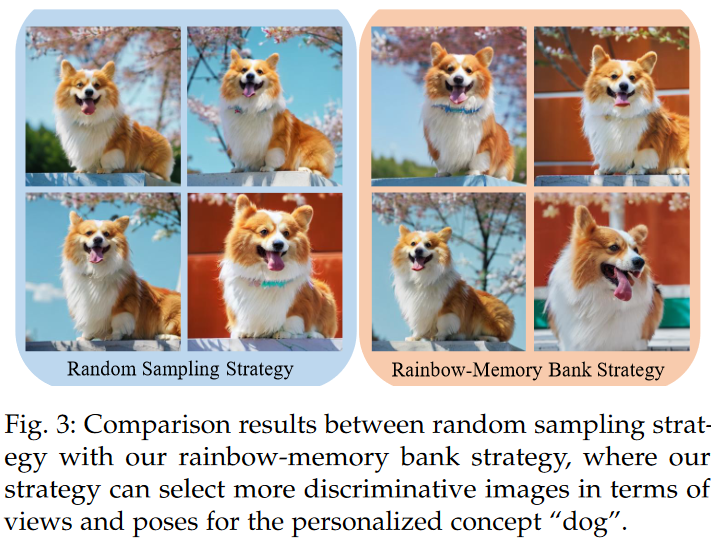

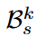: short-term memory bank
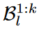: long-term memory bank
for current k-th task.

current k-th generation task를 배울 때, STM bank는 CLIP feature space에서 만들어진다. 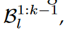 이 1부터 k-1까지의 LTM bank의 guide를 받아서.

LTM는 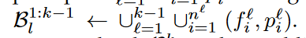 이렇게 구성됨.
f는 CLIP feature, p는 text prompt

 는 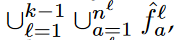 이렇게 CLIP features로 구성되어있는거고.

LTM bank에는 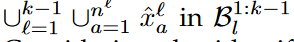 이 STM bank에 있는 CLIP features들을 diffusion model에 돌리면 생기는 원본 이미지를 말한다.

Considering the identifying characteristics for each past generation task, we define a score function to further cast the short-term memory bank :

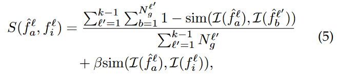

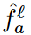, 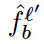 는 각각 l-th task의 a-th generated sample, l'-th task의 b-th generated sample에 해당하는 CLIP feature를 의미한다.

 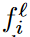 이 feature는 LTM bank인 안에 있는 l-th task의 i-th sample에 대한 feature를 의미.

sim(·) denotes the cosine similarity,

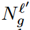 는 l'-th learned task에 대한 generated image의 총 숫자 를 의미하고,  

β > 0 is a trading-off parameter.

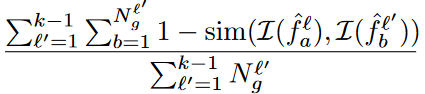 이 first term은 generated image의 catastrophic forgetting degree를 평가하기 위해서 만들어졌고,

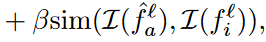
두번째 term은 LTM bank의 guidance를 소개하기 위한 중추적 역할이다.

이 score가 높은 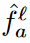 를 STM bank인 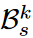 여기에 넣을 것이고, LTM bank 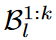 이거는 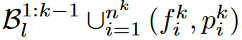 이걸로 recast될 것이다.

## 4 EXPERIMENTS 

### 4.1 Datasets and Evaluation 

### 4.2 Implementation Details 

### 4.3 Comparison Evaluation 

### 4.3.1 Lifelong Single-concept Generation Results 

### 4.3.2 Lifelong Multi-concept Generation Results 

### 4.3.3 Ablation Study 

## 5 CONCLUSION 

---

