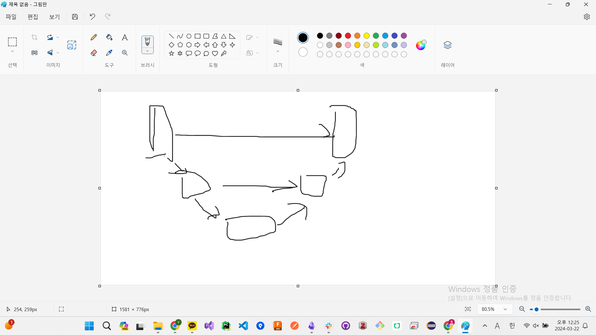

**motivation:**  

VAE를 알아야 한다. 이미지를 생성하는데, 가장 간단한 방법이, 

원래는 diffusion을 x, pixel 고안에서 했는데, latent space에서 diffusion process를 수행하겠다.

이거다.

VAE를 알아야 하고, 

VAE를 이해했으면, 사실 보면, 

diffusion, Unet이 뭔지.

Unet. Unet은, Latent 공간에서, process를 살펴보자면, 노이즈를 추가하고, 

noise 추가를 한 것을 ground truth라고 한다. 

모델이 디노이징 하도록 학습을 시키는 것이다. 수식을 잘 보면, 

sampling을 의미한다. 물결표시. 

분포 중에서, 하나를 뽑겠다. 이게 random noise다.

random noise에서, epsilon theta가 붙어있다. 모델이 예측한 노이즈.

모델이 예측한 노이즈랑, 실제 넣은 loss를 넣은 것.

노이즈 추가하고, 노이즈 제거하는데, 잘 제거하도록 한다. 그렇게 한 다음에, Unet과 attention. 

Unet은 뭐냐면, 

이미지 원본 복원, 압축하면서, 복구하는 것. 손상된 이미지 복구한다거나.

노이즈가 추가된 것은 이미지가 손상된 것이니깐, 손상된 이미지를 복원하는 형태로 Unet을 사용한다.

Unet은 손상된 이미지 복원.
VAE x --> z --> x'
노이즈가 추가된 z에서 x'으로 복원하는 것이다.
Unet 안에는 QKV가 있다. 

transformer는, QKV.
CNN.

conext 정보를 압축시킨다.

transformer는, 전체적인 정보 전달,

CNN은 부분적인 정보 전달.

오른쪽에 conditioning이 있다. 노이즈를 그냥 제거하는 것이 아니라, prompt를 줘서, 그거에 맞도록 생성하게 하는 것이다.

GPT에, 선글라스에 강아지 그려진 것을 그려줘.

선글라스 + 강아지 text에 denoising을 하게 된다. 그래서, tau_theta가 transformer 구조에 들어가게 된다.

원본 이미지에 합쳐져서.

transformer에는, 원본_latent_space + prompt, 지침이 transformer로 들어간다.

그래서 cross attention이라ㅣ고 한다. 이미지만 했는데, prompt와 이미지를 동시에 attention을 구한다. attention에 따라서, 노이즈를 제거하면, 원래 노이즈가 만들어지게 되는 것이다.

+DDPM, 노이즈를 추가하고, 노이즈를 제거한다.

dm(가우시안의 평균과 분산을 예측해서), ddpm(unet을 사용해서, epsilon만 예측하면 되는 것), ddim, 

이 논문에서도, epsilon만 예측하면 되는데, 

공간을 압축시킨다음에, ddpm을 적용시킨다.

distortion은 왜곡, 

rate는 dimension/bit, 이거는 bit가, 이미지상에서 하나의 픽셀. denoising을 할 때, 얼마나 많은 bit를 바꿨냐. rate가 클수록 더 많은 bit를 변환시켰다.

rate가 작을 때에는, distortion이 많이 감소.

기존 ddpm의 문제점. 어처피, 이미지를 생성해 나가는 과정에서, bit를 조금만 변화시켜도, distortion이 많이 줄어드네; bit를 노이즈를 제거해도, distortion이 감소. 근데 대부분의 학습 과정에는, 조금의 distortion을 줄이는 과정이다.

distortion이 생성된 이미지와 원본 이미지의 차이

낭비되는 bit가 많다. distortion을 줄이는 과정에서, bit가 늘어나면, distortion이 선형적으로 감소하는 것이 좋다.

픽셀 space라서, bit수가 너무 많이 바뀌고, 왜곡은 많이 일어나고.

근데 차라리 latent 공간에서 해도 상관이 없겠다.

텍스트랑 이미지랑 결합해주는 것이 CLIIP이다.

강인함이 커질수록 원본은 참조를 안함. 모델을 더 강해지는 것이니깐.

domain adaptation. 선글라스를 낀 사진.

분산을 1로 만드는 방법.

분산을 계산하는 방법.

결국

new_beta = (1-beta)Var[X] + beta

결국 1이 되어야 함. 최종 new_beta가.
