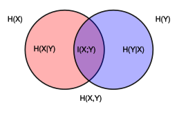

**motivation:**  정보량에 대해서 알아보자.

## entropy의 정의
entropy의 정의는, 정보를 표현할 수 있는 평균 최소 자원량을 의미한다. 정의는 sigma_i(p_i)(log(1/p_i))로 쓰는데, 최소 자원량이라는 말에 log(1/pi)가 들어가있고, 평균에 sigma_i(p_i)가 들어가있는 것이다. 왜 최소 자원량이라는 말에 log(1/pi)이게 들어가 있냐면, 1로 갈수록 0이 되고, 0으로 갈수록 무한대가 되기 떄문. 그래서 확률이 클수록, 그것을 표현하는 자원량은 적어도 되니깐. 이산의 경우에는 자원량이 bit이 되고, log_2 를 쓰는데, 근데 연속으로 가면 ln을 쓴다. 이산에서는 uniform이 entropy가 가장 크고, 연속에서는 가우시안이 entropy가 가장 크다고 한다. 

### 자원량이란? == information `content`

(출처: 위키피디아, information content)

## cross entropy
우선 cross entropy는 H(q,p)로 쓰고, 

-sigma_i(p_i)log(q_i)로 쓴다.

실제 정답 분포는 p_i를 쓰되, 자원량의 경우에는 내가 아는 분포로 쓰게 된다. optimal coding length는 q_i에서 가져오게 된다. 

## KL divergence

KL divergence의 정의는 알아서 찾아보고,

근데 KLdivergence = H(q,p) - H(p)가 된다. 여기서 H(q,p)는 cross entropy다.

그래서 one hot embedding을 쓰면, 하나가 1이고 나머지가 0이니깐, H(p)가 0이 되어서, KL divergence를 쓰는 것과 같게 되는 것.

## joint entropy

![{\displaystyle \mathrm {H} (X,Y)=-\sum _{x\in {\mathcal {X}}}\sum _{y\in {\mathcal {Y}}}P(x,y)\log _{2}[P(x,y)]}](https://wikimedia.org/api/rest_v1/media/math/render/svg/1c1b92b469840ecac93f75eff9beef3d03d6bbc1)

이게 햇갈리는 부분인데, [위키피디아](https://en.wikipedia.org/wiki/Joint_entropy) 의 정의를 보았을 때, notation이 같다. 그래서 이 [MATHEMATICS 글(# Relation between cross entropy and joint entropy)]((https://math.stackexchange.com/questions/2505015/relation-between-cross-entropy-and-joint-entropy))을 보면, 사실 practitioner들은 둘을 혼용해서 쓴다고 한다. notation을.

위키피디아에 이런 diagram이 있는데, 이런 것을 보면, 여기서 H(X,Y)는 joint entropy를 의미한다.

근데 유의해야할 것이, 빨간색 원이 H(X)인 것이고, 파란색 원이 H(Y)고, 그리고 H(X,Y)가 H(X)+H(Y) - I(X,Y) 를 의미한다. 즉 두개의 원을 합친 것이 H(X,Y)인 것이다.

$$P_X(x) = \sum_{y} P_{XY}(x, y)$$

marginality도 이해하고 있는 상황에서, 

## conditional entropy

conditional entropy는 최소 자원량에 condition이 붙는 것이다. 

이런 성질일 있고,

**H(Y|X) = H(X,Y) - H(X)** 의 성질을 나타낸다.

## mutual information, 상호의존성 정보.

[https://process-mining.tistory.com/141](https://process-mining.tistory.com/141)

여기에 따르면, 결국 상호의존성 정보는, 두개의 random variable이 얼마나 종속되어 있는지 볼 수 있는 지표다. correlation과 비슷하지만, correlation이 볼 수 없는 것을 볼 수 있다고 한다.

MIC(MI라고 생각)이 크고, correlation이 작으면, 어떤 비선형적 관계가 높다는 것을 알 수 있음. 둘다 크면 선형적 관계, 둘다 작으면 관계 없음.

정의는, 
|

이거다.

또,

이런 성질을 만족한다.

결국 상호의존성 정보량은, 하나의 random variable을 알게 되었을 때, 그 uncertainty가 감소하는 형태를 따른다. 왜냐하면 H(X) - H(X|Y) 형태를 띠는데, Y를 알게 되었을 때, X의 정보량에서 빼기를 해주니깐. 

만약 두개의 random variable이 독립이라면, 값은 0이 된다.

